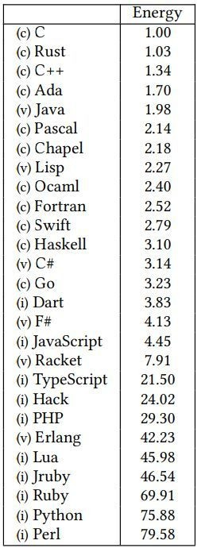

# **Programación funcional a través de OCaml**
<br/>
<br/>
<br/>
<br/>
José Castillo Lema
<p class="small-text"><a href="https://github.com/josecastillolema/talks">https://github.com/josecastillolema/talks</a></p>

---
## whoami

<style>
@import 'https://maxcdn.bootstrapcdn.com/font-awesome/4.7.0/css/font-awesome.min.css';
</style>
<i class="fa fa-rss"></i> [Blog](https://josecastillolema.github.io/)
<i class="fa fa-linkedin"></i> [LinkedIn](https://www.linkedin.com/in/jose-castillo-lema/)
<i class="fa fa-github"></i> [GitHub](https://github.com/josecastillolema)
<i class="fa fa-stack-overflow"></i> [Stack Overflow](http://stackoverflow.com/josé-castillo-lema)
<i class="fa fa-google"></i> [Google Scholar](https://scholar.google.com.br/citations?user=_xNpHiwAAAAJ)
<i class="fa fa-book"></i> [ResearchGate](https://www.researchgate.net/profile/Jose_Castillo-Lema)
<i class="fa fa-inbox"></i> [Email](mailto:josecastillolema@gmail.com)

---
## Índice
- Conceptos de programación funcional (funciones de primera clase, funciones puras, inmutabilidad, recursión)
- Fundamentos de OCaml (tipos de datos, sintax, operaciones básicas)
- Biblioteca estandar de OCaml
- Técnicas de pruebas y depuración en programación funcional
- Ejemplos del mundo real (analizadores, intérpretes, etc.)

---
## OCaml (Objective Caml)
<style scoped>section { font-size: 32px; }</style>
- Creado en el **1996** en **Inria**, proviene de una familia de lenguajes denominados **ML** (Meta Language)
- Propósito **general** y **compilado**
- Estáticamente tipado y con **interferencia de tipos** y **evaluación estricta**
- **Alto** nivel con ***garbage collection*** :arrow_right: ***memory safe***
- Multi **paradigma**
  - **Funcional**
  - Imperativa
  - Orientada a objetos
- Multi **plataforma** (incluyendo JavaScript y WebAssemby)

---
### Tipos de lenguajes
<style>
img[alt~="center"] {
  display: block;
  margin: 0 auto;
}
</style>


---
## Tipos de lenguajes
<style scoped>
table {
  font-size: 26px;
}
</style>
<center>

Lenguaje | Imperativo                                                           | Funcional
---------|----------------------------------------------------------------------|----------
Dinámico | <ul><li>Python</li><li>Ruby</li><li>Javascript</li><li>PHP</li></ul> | <ul><li>Lisp</li><li>Scheme</li><li>Clojure</li></ul>
Estático | <ul><li>C</li><li>C#</li><li>Java</li><li>C++</li></ul>              | <ul><li>**OCaml**</li><li>Scala</li><li>Haskell</li><li>**F#**</li></ul>

---
## Energía


---
## Software escrito en OCaml
 - **Coq**, un asistente de pruebas
 - Partes del cliente **Docker** de macOS
 - **Facebook Messenger**, la versión web
 - **MirageOS**, para crear unikernels
 - **MLdonkey**, transferencia de archivos *peer-to-peer*
 - **Tezos**, una plataforma de bitcoin
 - **Xen Cloud Platform** y **XenServer**, plataformas de virtualización

---
## Frontend
 - ReasonML from Facebook
 - BuckleScript

---
## Usuarios
 - Ahrefs
 - Bloomberg
 - Citrix
 - Docker
 - Facebook
 - Jane Street

---
## OCaml *vs* Python

<div class="container">
<div class="col">

En **OCaml**:
```ocaml
(* sum : int list -> int *)
let rec suma = function
  | [] -> 0
  | h::t -> h + sum t

assert (suma [1;2;3;4] = 10)
print_endline "Éxito!"

(* suma' : int list -> int *)
let suma' list = List.fold_left (+) 0 list
```
</div>
<div class="col">

En **Python**:
```python
def suma (list):
  total = 0
  for num in list:
    total = total + num
  return total

assert (suma([1,2,3,4]) == 10)
print("Éxito!")

# Usando list comprehension
def suma2 (list):
  acc = 0
  return [acc := acc + x for x in list][-1]
```
</div>
</div>

---
## OCaml *vs* Python (tipos)

<div class="container">
<div class="col">

En **OCaml**, no compila:
<br/>

```ocaml
suma ['a'; 'b'; 'c'; 'd']
(* Error: This expression has type char
   but an expression was expected of type int *)

suma [1.1; 2.; 3.; 4.]
(* Error: This expression has type float
   but an expression was expected of type int *)
```
</div>
<div class="col">

En **Python** compila, pero falla en tiempo de ejecución:
```python
suma(['a','b','c','d'])
# Traceback (most recent call last):
#  In sum
#     total = total + num
#            ~~~~~~^~~~~
# TypeError: unsupported operand type(s) for +:
#  'int' and 'str'

suma([1.1, 2, 3, 4])
# 10.1
```
</div>
</div>

---
## Tipos
<style scoped>
table {
  font-size: 26px;
}
</style>
<center>

Tipo      | Ejemplo         | Operaciones
----------|-----------------|------------
`unit`    | `()`            |
`bool`    | `true` `false`  | `&&` `\|\|`
`int`     | `1`             | `+` `-` `*` `/` `**`
`float`   | `1.`            | `+.` `-.` `*.` `/.`
`char`    | `'a'`           | `^`
`string`  | `"hola"`        | `^`
`list`    | `[1; 2]`        | `::` `@`
`'a * 'a` | `(1, 2)`        | `fst` `snd`
`ref`     | `ref 1`         | `!` `:=`
`array`   | `[\| 1; 2; \|]` | `.() <-`

---
## OCaml *vs* Python (tipos)

<style scoped>section { font-size: 32px; }</style>
<div class="container">
<div class="col">

En **OCaml**:

```ocaml
[1; 'a']
(* Error: This expression has type char
  but an expression was expected of type int *)

1 + 2
(* -: int = 3 *)

1.1 +. 2.1
(* - : float = 3.2 *)

"a" ^ "b"
(* - : string = "ab" *)

1.1 +. 2
(* Error: This expression has type int
   but an expression was expected of type float *)

```
</div>
<div class="col">

En **Python**:

```python
[1, 'a']
# [1, 'a']

1 + 2
# 3

1.1 + 2.1
# 3.2

"a" + "b"
# 'ab'

1.1 + 2
#3.1
```
</div>
</div>

---
## Funciones y *pattern matching*

---
## Aplicación parcial

<style scoped>section { font-size: 32px; }</style>
<div class="container">
<div class="col">

En **OCaml**:
```ocaml
(* suma : int -> int -> int *)
let suma x y = x + y

(* suma1: suma1 : int -> int *)
let suma1 = suma 1

suma1 1
(* - : int = 2 *)
```
</div>

<div class="col">


En **Python**, por defecto:
```python
def suma (x, y):
  return x + y

suma (1)
# TypeError: suma() missing 1
# required positional argument: 'y'
```

Usando la librería [functools](https://docs.python.org/3/library/functools.html):
```python
from functools import partial
suma1 = partial (suma, 1)
suma1 (1)
# 2
```
</div>
</div>

---
## Polimorfismo

---
## Option

---
## Map

<div class="container">
<div class="col">

En **OCaml**:
```ocaml
(* ('a -> 'b) -> 'a list -> 'b list *)
List.map ((+) 1) [1; 2; 3]
(* - : int list = [2; 3; 4] *)
```
</div>

<div class="col">

En **Python**, usando un bucle `for`: 
```python
lista_nueva = []
for elemento in [1, 2, 3]:
  lista_nueva.append(elemento + 1)
lista_nueva
# [2, 3, 4]
```

Usando *list comprehension*:
```python
[x+1 for x in [1, 2, 3]]
# [2, 3, 4]
```
</div>
</div>

---
## Fold (reduce)

---
## Filter

---
## Futuro

- OCaml 5, multicore ...

---
## Referencias

 - [Why OCaml](https://www.youtube.com/watch?v=v1CmGbOGb2I) por Yaron Minsky
 - [Nekoma Talks #5 - How did we arrive at this mess?](https://www.youtube.com/watch?v=lSaZe8QN8jQ&list=PLafNlGaxdt67E5C_5MOZnCj7kQ2XwyVds&index=6) por Edil Medeiros

---
## Recursos
- [OCaml website](https://ocaml.org/)
- Curso de la Universidad de Cornell: [OCaml Programming: Correct + Efficient + Beautiful](https://cs3110.github.io/textbook/cover.html)
- Libro: [Real World OCaml - Functional programming for the masses](https://dev.realworldocaml.org/)
- Blog: [F# for Fun and Profit](https://fsharpforfunandprofit.com/)
- Desafíos
  - [99 problemas](https://ocaml.org/exercises) inspirados en Ninety-Nine Lisp Problems
  - [Learn OCaml](https://ocaml-sf.org/learn-ocaml-public/)
  - [Exercism](https://exercism.org/tracks/ocaml)
