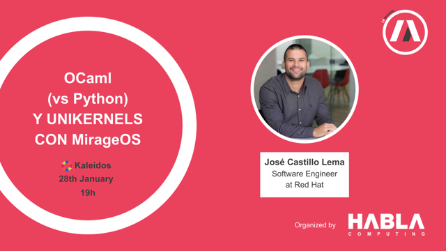
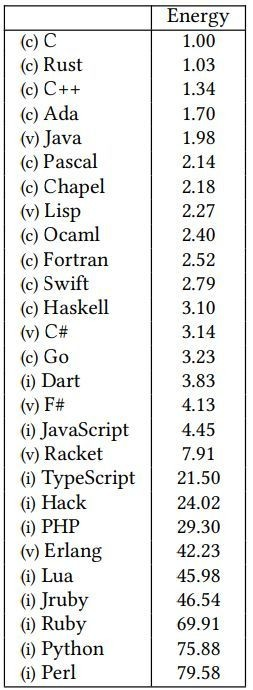

<style>
img[alt~="center"] {
  display: block;
  margin: 0 auto;
}
</style>



---

# **OCaml (vs Python) y unikernels con MirageOS**
<br/>
<br/>
<br/>
<br/>
José Castillo Lema
<p class="small-text"><a href="https://github.com/josecastillolema/talks">https://github.com/josecastillolema/talks</a></p>

---
## whoami

<style>
@import 'https://maxcdn.bootstrapcdn.com/font-awesome/4.7.0/css/font-awesome.min.css';
</style>
<i class="fa fa-rss"></i> [Blog](https://josecastillolema.github.io/)
<i class="fa fa-linkedin"></i> [LinkedIn](https://www.linkedin.com/in/jose-castillo-lema/)
<i class="fa fa-github"></i> [GitHub](https://github.com/josecastillolema)
<i class="fa fa-stack-overflow"></i> [Stack Overflow](http://stackoverflow.com/josé-castillo-lema)
<i class="fa fa-google"></i> [Google Scholar](https://scholar.google.com.br/citations?user=_xNpHiwAAAAJ)
<i class="fa fa-book"></i> [ResearchGate](https://www.researchgate.net/profile/Jose_Castillo-Lema)
<i class="fa fa-inbox"></i> [Email](mailto:josecastillolema@gmail.com)

---
## Índice
- Presentación del lenguaje
- *Software* escrito en OCaml
- Fundamentos de OCaml (tipos de datos, sintax, operaciones básicas)
- Unikernels y MirageOS
- *Tooling*
- Futuro

---
### Historia
<style>
img[alt~="center"] {
  display: block;
  margin: 0 auto;
}
</style>


---
### Programación funcional

- Características
  - **Funciones puras**, sin efectos colaterales
  - **Inmutabilidad**, generamos nuevos valores
  - **Recursión**, sin bucles
  - **Funciones de orden superior**
- Ventajas
  - Código más claro y más fácil de razonar sobre
  - Escalabilidad
  - Más fácil de testar

---
## OCaml (Objective Caml)
<style scoped>section { font-size: 30px; }</style>
- Creado en el **1996** en [**Inria**](https://www.inria.fr/en) proviene de una familia de lenguajes denominados **ML** (Meta Language)
- Propósito **general** y **compilado**
- **Estáticamente** y fuertemente **tipado**
- Implementa **interferencia de tipos** y **evaluación estricta**
- **Alto** nivel con ***garbage collection*** :arrow_right: ***memory safe***
- Multi **paradigma**
  - **Funcional**
  - Imperativa
  - Orientada a objetos
- Multi **plataforma** (incluyendo JavaScript y WebAssembly)

---
## Tipos de lenguajes
<style scoped>
table {
  font-size: 26px;
}
</style>
<center>

| Lenguaje | Imperativo                                                           | Funcional                                                                           |
| -------- | -------------------------------------------------------------------- | ----------------------------------------------------------------------------------- |
| Dinámico | <ul><li>Python</li><li>Ruby</li><li>Javascript</li><li>PHP</li></ul> | <ul><li>Lisp</li><li>Scheme</li><li>Clojure</li><li>Erlang</li><li>Elixir</li></ul> |
| Estático | <ul><li>C</li><li>C#</li><li>Java</li><li>C++</li></ul>              | <ul><li>**OCaml**</li><li>Scala</li><li>Haskell</li><li>**F#**</li></ul>            |

---
## Energía


---
## Software escrito en OCaml
 - [**Coq**](https://coq.inria.fr/): un asistente de pruebas
 - Partes del cliente **Docker** de macOS
 - **Facebook Messenger**: la versión web
 - [**Irmin**](https://irmin.org/): un banco de datos distribuído basado en Git
 - [**MirageOS**](https://mirage.io/): para crear _unikernels_
 - **MLdonkey**: transferencia de archivos *peer-to-peer*
 - [**Tezos**](https://tezos.com/): una plataforma de _bitcoin_
 - [**virt-v2v**](https://github.com/libguestfs/virt-v2v): un conversor de servidores a KVM de Red Hat
 - **Xen Cloud Platform** y **XenServer**: plataformas de virtualización

---
## Frontend
 - Nuevos **lenguajes**
   - [**ReasonML**](https://reasonml.github.io/) por Facebook
   - [**ReScript**](https://rescript-lang.org/) por Bloomberg
 - **Compiladores** de OCaml a JavaScript
   - [**js_of_ocaml**](https://github.com/ocsigen/js_of_ocaml)
   - [**Melange**](https://melange.re/)
 - **Influencias**
   - [**Elm**](https://elm-lang.org/)

---
## Usuarios
 - Ahrefs
 - Bloomberg
 - Citrix
 - Docker
 - Facebook
 - Jane Street
 - Red Hat

---
## OCaml *vs* Python

<div class="container">
<div class="col">

En **OCaml**:
```ocaml
(* sum : int list -> int *)
let rec suma = function
  | [] -> 0
  | h::t -> h + sum t

assert (suma [1;2;3;4] = 10)
print_endline "Éxito!"
```
</div>
<div class="col">

En **Python**:
```python
def suma (list):
  total = 0
  for num in list:
    total = total + num
  return total

assert (suma([1,2,3,4]) == 10)
print("Éxito!")
```
</div>
</div>

---
## OCaml *vs* Python

<div class="container">
<div class="col">

En **OCaml**, no compila:
<br/>

```ocaml
suma ['a'; 'b'; 'c'; 'd']
(* Error: This expression has type char
   but an expression was expected of type int *)

suma [1.1; 2.; 3.; 4.]
(* Error: This expression has type float
   but an expression was expected of type int *)
```
</div>
<div class="col">

En **Python** compila, pero falla en tiempo de ejecución:
```python
suma(['a','b','c','d'])
# Traceback (most recent call last):
#  In sum
#     total = total + num
#            ~~~~~~^~~~~
# TypeError: unsupported operand type(s) for +:
#  'int' and 'str'

suma([1.1, 2, 3, 4])
# 10.1
```
</div>
</div>

---
## Tipos
<style scoped>
table {
  font-size: 26px;
}
</style>
<center>

| Tipo      | Ejemplo         | Operaciones          |
| --------- | --------------- | -------------------- |
| `unit`    | `()`            |
| `bool`    | `true` `false`  | `&&` `\|\|`          |
| `int`     | `1`             | `+` `-` `*` `/` `**` |
| `float`   | `1.`            | `+.` `-.` `*.` `/.`  |
| `char`    | `'a'`           | `^`                  |
| `string`  | `"hola"`        | `^`                  |
| `list`    | `[1; 2]`        | `::` `@`             |
| `'a * 'a` | `(1, 2)`        | `fst` `snd`          |
| `ref`     | `ref 1`         | `!` `:=`             |
| `array`   | `[\| 1; 2; \|]` | `.() <-`             |

---
## OCaml *vs* Python (tipos)

<style scoped>section { font-size: 32px; }</style>
<div class="container">
<div class="col">

En **OCaml**:

```ocaml
[1; 'a']
(* Error: This expression has type char
   but an expression was expected of type int *)

1 + 2
(* -: int = 3 *)

1.1 +. 2.1
(* - : float = 3.2 *)

"a" ^ "b"
(* - : string = "ab" *)

1.1 +. 2
(* Error: This expression has type int
   but an expression was expected of type float *)

```
</div>
<div class="col">

En **Python**:

```python
[1, 'a']
# [1, 'a']

1 + 2
# 3

1.1 + 2.1
# 3.2

"a" + "b"
# 'ab'

1.1 + 2
#3.1
```
</div>
</div>

---
## _Product types_ (registros) y _union types_ (variantes)

<style scoped>section { font-size: 28px; }</style>
<div class="container">
<div class="col">

Tenemos que representar la siguiente regla de negocio:
> **Los clientes deben tener email o direccion**

En **OCaml**:
```ocaml
type contacto =
  | Email of string
  | Direccion of string
  | EmailyDireccion of string * string

type persona = {
  nombre: string;
  contacto: contacto;
}
```
</div>

<div class="col">

En **Python**:
 - Usando clases y herencia?



</div>
</div>

---
## Aplicación parcial

<style scoped>section { font-size: 32px; }</style>
<div class="container">
<div class="col">

En **OCaml**:
```ocaml
(* suma : int -> int -> int *)
let suma x y = x + y

(* suma1: suma1 : int -> int *)
let suma1 = suma 1

suma1 1
(* - : int = 2 *)
```
</div>

<div class="col">

En **Python**, por defecto:
```python
def suma (x, y):
  return x + y

suma (1)
# TypeError: suma() missing 1
# required positional argument: 'y'
```

Usando la librería [functools](https://docs.python.org/3/library/functools.html):
```python
from functools import partial
suma1 = partial (suma, 1)
suma1 (1)
# 2
```
</div>
</div>

---
## Tipos inmutables

<style scoped>section { font-size: 32px; }</style>
<div class="container">
<div class="col">

En **OCaml**:
```ocaml
let my_list = [1; 2; 3]
(* int list = [1; 2; 3] *)

0 :: my_list
(* int list = [0; 1; 2; 3] *)

my_list
(* int list = [1; 2; 3] *)
```
</div>

<div class="col">

En **Python**:
```python
mylist = [1, 2, 3]

mylist.insert (0, 0)

myList
# [0, 1, 2, 3]
```

| Mutable      | Inmutable          |
| ------------ | ------------------ |
| `list`       | `tuple`            |
| `set`        | `frozenset`        |
| `dictionary` | `MappingProxyType` |

</div>
</div>

---
## _Pipes_

<div class="container">
<div class="col">

En **OCaml**:
```ocaml
suma1 (suma1 4)
(* - : int = 6 *)

suma1 @@ suma1 4
(* - : int = 6 *)

4 |> suma1 |> suma1
(* - : int = 6 *)
```
</div>

<div class="col">

En **Python**:
```python
suma1 (suma1 (4))
```

Usando la biblioteca *pipe*?
</div>
</div>

---
## Polimorfismo

<style scoped>section { font-size: 28px; }</style>
<div class="container">
<div class="col">

**OCaml** implementa **polimorfismo paramétrico**:
```ocaml
(* 'a -> 'a -> bool *)
let compara input1 input2 =
  input1 = input2
```

**OCaml** no implementa **polimorfismo _ad-hoc_**:
```ocaml
1 + 1
(* - : int = 2 *)

1. + 1.
(* Error: This expression has type float
   but an expression was expected of type int *)
```

</div>

<div class="col">

**Python** también implementa **polimorfismo paramétrico**:
```python
def igual (a, b):
  return (a==b)
```

**Python** sí implementa **polimorfismo _ad-hoc_**:
```python
1 + 1
# 2

1. + 1.
# 2.

"a" + "b"
# 'ab'
```

</div>
</div>

---
## Option

<style scoped>section { font-size: 28px; }</style>
<div class="container">
<div class="col">

En **OCaml**:
```ocaml
type 'a option =
  | None
  | Some of 'a

(* 'a list -> 'a *)
List.hd []
(* Exception: Failure "hd". *)

(* 'a option list -> 'a option *)
let hd = function
  | h::t -> Some h
  | [] -> None

hd [];;
(* - : 'a option = None *)

hd [1; 2; 3]
(* - : int option = Some 1 *)
```
</div>

<div class="col">

En **Python**:
```python
[][0]
# IndexError: list index out of range

def hd (list):
  try:
    return list[0]
  except:
    return None

hd ([])
#

hd ([1,2,3])
# 1
```
</div>
</div>

---
## *Pattern matching*

<div class="container">
<div class="col">

En **OCaml**:
```ocaml
match (hd [2]) with
  | None -> 0
  | Some x -> x
(* - : int = 2 *)
```
</div>

<div class="col">

En **Python**, desde la versión **3.10**:
```python
match hd ([2]):
  case None: print (0)
  case int(n): print(n)
# 2
```
</div>
</div>

---
## Map

<div class="container">
<div class="col">

En **OCaml**:
```ocaml
(* ('a -> 'b) -> 'a list -> 'b list *)
List.map ((+) 1) [1; 2; 3]
(* - : int list = [2; 3; 4] *)
```
</div>

<div class="col">

En **Python**, usando un bucle `for`:
```python
lista_nueva = []
for elemento in [1, 2, 3]:
  lista_nueva.append(elemento + 1)
lista_nueva
# [2, 3, 4]
```

Usando *list comprehension*:
```python
[x+1 for x in [1, 2, 3]]
# [2, 3, 4]
```
</div>
</div>

---
## Fold (reduce)
<div class="container">
<div class="col">

En **OCaml**:
```ocaml
(* int list -> int *)
let rec sum = function
  | [] -> 0
  | h :: t -> h + sum t

(* int list -> int *)
let sum' l = List.fold_left ( + ) 0 l
```
</div>

<div class="col">

En **Python**:
```python
# Usando la función incorporada
sum ([1, 2])
# 3

# Usando for
total_sum = 0
for item in mylist:
    total_sum += item

# Usando list comprehension
def sum2 (list):
  acc = 0
  return [acc := acc + x for x in list][-1]
```
</div>
</div>

---
## Filter

<div class="container">
<div class="col">

En **OCaml**:
```ocaml
List.filter (fun x -> x>2) [1; 2; 3]
(* - : int list = [3] *)
```
</div>

<div class="col">

En **Python**:
```python
l = filter(lambda x: x > 2, [1, 2 ,3])
print(list(l))
# [3]
```
</div>
</div>

---
## Unikernels


---
## MirageOS

*Library operating system*

- Inicio rápido
- Binarios pequeños
- Consumo reducido de recursos

---
## MirageOS

```ocaml
open Lwt.Infix

module Hello (Time : Mirage_time.S) = struct
  let start _time =
    let rec loop = function
      | 0 -> Lwt.return_unit
      | n ->
          Logs.info (fun f -> f "hello");
          Time.sleep_ns (Duration.of_sec 1) >>= fun () -> loop (n - 1)
    in
    loop 4
end
```

---
## Tooling
- [utop](https://github.com/ocaml-community/utop): entorno interactivo (REPL)
- [dune](https://dune.build/): sistema de compilación
- [opam](https://opam.ocaml.org/): gestor de paquetes
- [ocaml-lsp](https://github.com/ocaml/ocaml-lsp): el protocolo de servidor de lenguaje de OCaml
- [OCaml platform](https://marketplace.visualstudio.com/items?itemName=ocamllabs.ocaml-platform): extensión para VSCode
- [F*](https://fstar-lang.org/): OCaml con tipos dependientes

---
## Futuro

<style scoped>section { font-size: 32px; }</style>

- OCaml 5
  - [Eio](https://github.com/ocaml-multicore/eio): Effects-Based Parallel IO
  - Soporte a _multicore_
    - Concurrencia :arrow_right: _effect handlers_
    - Paralelismo :arrow_right: _domains_
  - *(Untyped) algebraic effects*
- A largo plazo
  - *Modular implicits*
    - Rust *traits* / Haskell *type classes*
  - *Typed algebraic effects*

---
## Referencias

 - [Why OCaml](https://www.youtube.com/watch?v=v1CmGbOGb2I) por Yaron Minsky
 - [Nekoma Talks #5 - How did we arrive at this mess?](https://www.youtube.com/watch?v=lSaZe8QN8jQ&list=PLafNlGaxdt67E5C_5MOZnCj7kQ2XwyVds&index=6) por Edil Medeiros

---
## Recursos
<style scoped>section { font-size: 30px; }</style>
- [OCaml website](https://ocaml.org/)
- Curso de la Universidad de Cornell: [OCaml Programming: Correct + Efficient + Beautiful](https://cs3110.github.io/textbook/cover.html)
- Libro: [Real World OCaml - Functional programming for the masses](https://dev.realworldocaml.org/)
- Blogs
  - [F# for Fun and Profit](https://fsharpforfunandprofit.com/)
  - [Thomas Leonard's blog](https://roscidus.com/blog/)
- Desafíos
  - [99 problemas](https://ocaml.org/exercises) inspirados en Ninety-Nine Lisp Problems
  - [Learn OCaml](https://ocaml-sf.org/learn-ocaml-public/)
  - [Exercism](https://exercism.org/tracks/ocaml)
