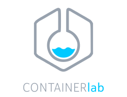
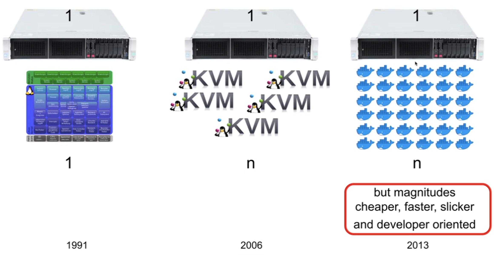
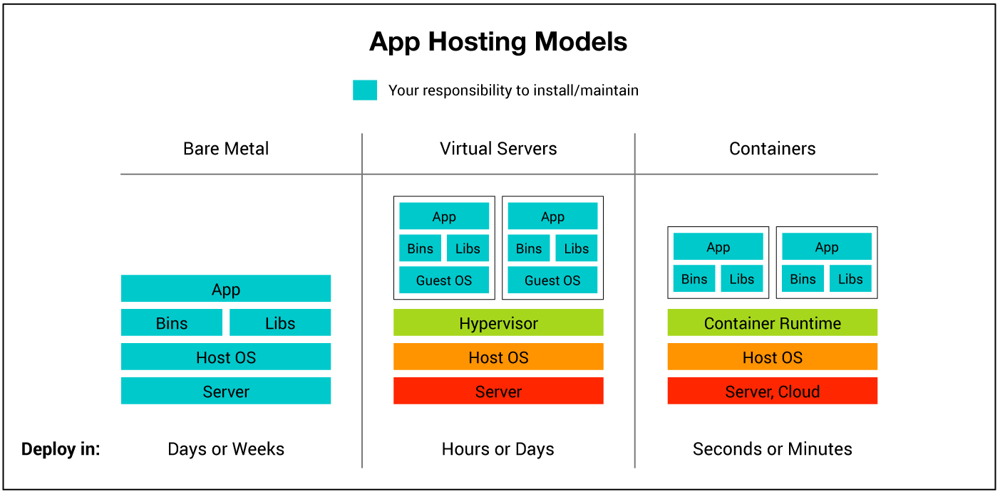
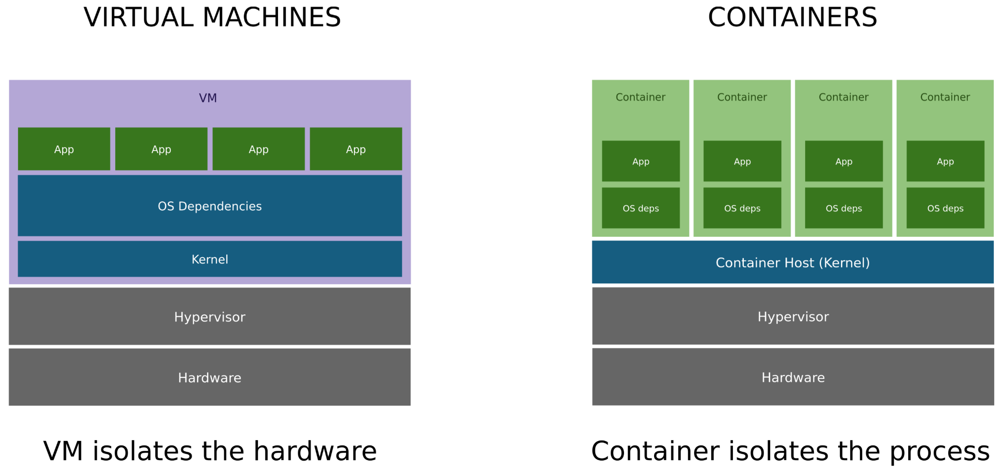
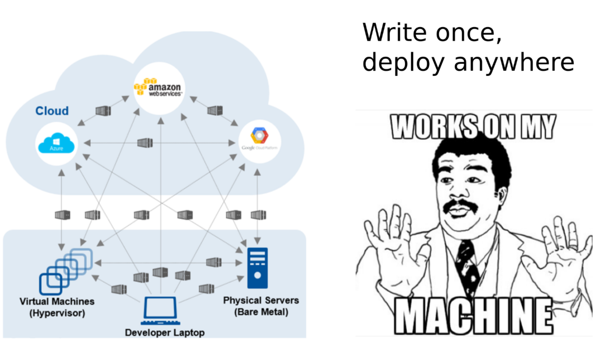
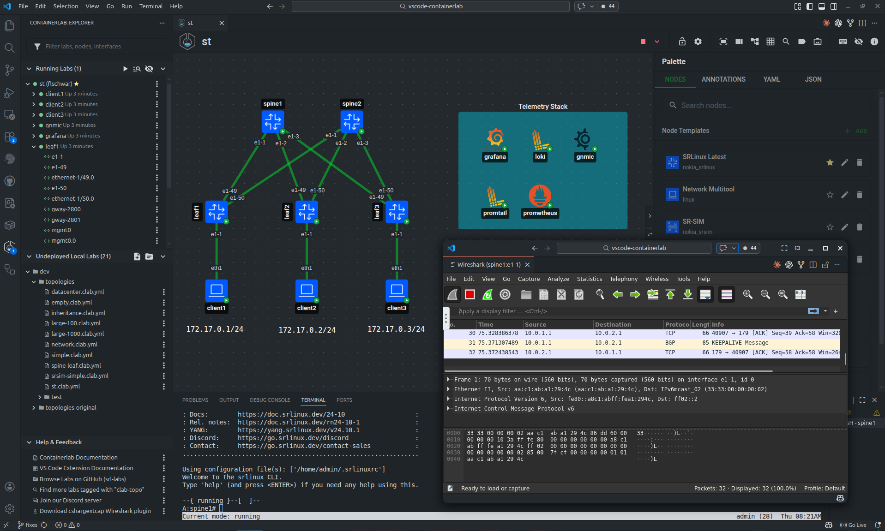
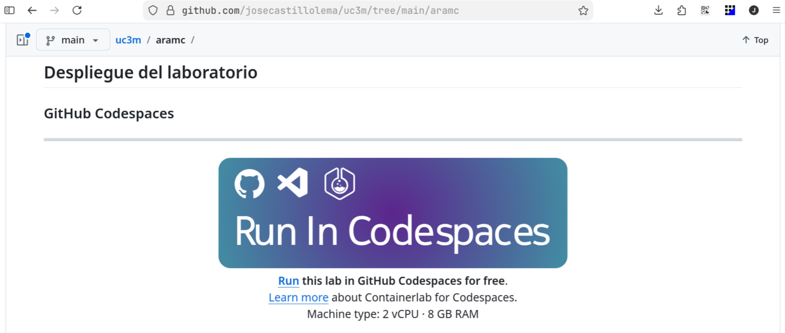
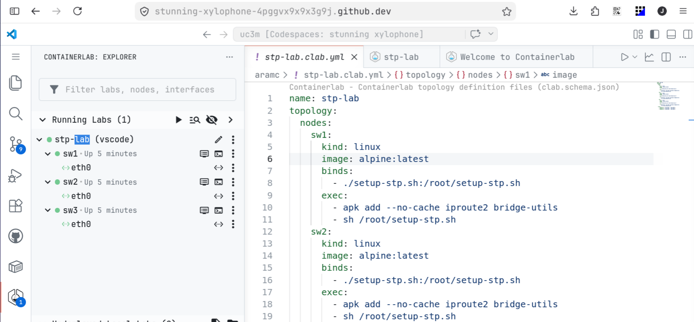

<!-- cSpell:language en,es -->

# **Containerlab: crea tu propio laboratorio de redes**
<br/>
<br/>
<br/>
<br/>
<br/>
José Castillo Lema
<p class="small-text"><a href="https://github.com/josecastillolema/talks">https://github.com/josecastillolema/talks</a></p>

---
## whoami

<style>
@import 'https://maxcdn.bootstrapcdn.com/font-awesome/4.7.0/css/font-awesome.min.css';
</style>
<i class="fa fa-rss"></i> [Blog](https://josecastillolema.github.io/)
<i class="fa fa-linkedin"></i> [LinkedIn](https://www.linkedin.com/in/jose-castillo-lema/)
<i class="fa fa-github"></i> [GitHub](https://github.com/josecastillolema)
<i class="fa fa-stack-overflow"></i> [Stack Overflow](http://stackoverflow.com/josé-castillo-lema)
<i class="fa fa-google"></i> [Google Scholar](https://scholar.google.com.br/citations?user=_xNpHiwAAAAJ)
<i class="fa fa-book"></i> [ResearchGate](https://www.researchgate.net/profile/Jose_Castillo-Lema)
<i class="fa fa-inbox"></i> [Email](mailto:josecastillolema@gmail.com)

---
## Índice
- Desafíos a la a hora de gestionar laboratorios de redes
- Máquinas virtuales *vs* containers
- Cómo containerlab puede ayudar
- Imágenes *open source*
- Ejemplos prácticos y *demos*

---
## Desafíos

- Multitud de herramientas diferentes (como simuladores) para cada laboratorio específico
- Gestión de dependencias de cada herramienta (por ej. simuladores escritos en JAVA / JVM)
- Falta de estandarización
- Dificultar para contribuir a los laboratorios
- Algunas soluciones basadas en máquinas virtuales como [GNS3](https://www.gns3.com/) / [EVE-NG](https://www.eve-ng.net/) (demandan muchos recursos)

---
## [Containerlab](https://containerlab.dev/)

- CLI para crear y gestionar laboratorios de red basados en contenedores
- Permite definir topologías de red complejas de forma rápida y reproducible
- Enfocado en Network Operating Systems (NOS) containerizados (Cisco, Arista, Juniper, SONiC, etc.)
- Alternativa moderna a [GNS3](https://www.gns3.com/) / [EVE-NG](https://www.eve-ng.net/)

---
## Containerlab

- **Lab-as-Code (IaC)** → topologías definidas en archivos YAML (.clab)
  - Reproducible y versionable (git friendly)
- **Multi-vendor** → soporta múltiples fabricantes y soluciones *open source*
- **Container-based** → usa Docker para levantar nodos de red
  - Muy rápido de desplegar (segundos/minutos)
  - Ideal para testing sin hardware físico
- **Virtual wiring** → conecta contenedores como si fueran dispositivos reales

---
## Casos de uso

- **Testing** de diseños de red y features
- **Laboratorios** para NetDevOps / automatización
- **Demos** y entornos reproducibles
- Preparación de examenes de certificación (i.e.: CCNA, HCNA, etc.)

---
### Virtualización


---
### VMs *vs* containers


---
### VMs *vs* containers


---
### Containers


---
## Imágenes *open source*
<style scoped>section { font-size: 30px; }</style>
- [Alpine Linux](https://www.alpinelinux.org/)
  - Posibilidad de usar todos los comandos de red del Kernel: `ip`, `ping`, `bridge`, `arptables`, `arping`, `iptables`, `tc`, etc.
- [Open vSwitch](https://www.openvswitch.org/)
  - CLI propio: `ovs-vsctl`
- [FRRouting](https://docs.frrouting.org)
  - Config file: `/etc/frr/frr.conf`

---
## Ejemplo - topología

<br/>
<br/>

<style scoped>pre { margin: auto; width: 20%; font-size: 1.65em; }</style>

```
   sw1
  /   \
sw2---sw3
```

---
## Ejemplo - definición

```yaml
name: stp-lab
topology:
  nodes:
    sw1:
      kind: linux
      image: alpine:latest
      binds:
        - ./setup-stp.sh:/root/setup-stp.sh
      exec:
        - apk add --no-cache iproute2 bridge-utils
        - sh /root/setup-stp.sh
    sw2:
      ...
    sw3:
      ...
  links:
    - endpoints: ["sw1:eth1", "sw2:eth1"]
    - endpoints: ["sw2:eth2", "sw3:eth1"]
    - endpoints: ["sw3:eth2", "sw1:eth2"]
```

---
## Ejemplo - *script* de configuración

```sh
#!/bin/sh
set -eux

# Create a Linux bridge and attach interfaces
ip link add name br0 type bridge
ip link set br0 type bridge stp_state 1   # Enable STP

# Attach all ethernet interfaces except lo
for iface in $(ls /sys/class/net | grep ^eth); do
  ip link set "$iface" master br0
done

# Bring up interfaces and bridge
for iface in $(ls /sys/class/net | grep ^eth); do
  ip link set "$iface" up
done

ip link set br0 up

# Display initial state
bridge link
```

---
## Demo - prerrequisitos
 - Gestor de containers: [Docker](https://www.docker.com/) o [Podman](https://podman.io/)
 - [Containerlab](https://containerlab.dev/)
 - Repositório: https://github.com/josecastillolema/uc3m/tree/main/aramc

---
## Demo
 - Creación del ambiente:
    ```sh
    sudo containerlab deploy --runtime podman -t stp-lab.clab.yml
    ```
 - Ver contenedores:
    ```sh
    sudo podman ps
    ```
 - Acceso a los switches:
    ```sh
    sudo podman exec -it clab-stp-lab-sw1 sh
    ```

---
## Integración con Visual Studio Code



---
## GitHub Codespaces

 - Entorno de desarrollo en la nube integrado con GitHub
 - Permite abrir proyectos en un editor tipo VS Code directamente desde el navegador
 - Incluye un contenedor preconfigurado con todas las dependencias necesarias (`devcontainer.json`)
 - Evita configuraciones locales complejas (instalación de herramientas, SDKs, etc.)
 - Permite desarrollar, probar y depurar código desde cualquier dispositivo

---
## Integración con GitHub Codespaces

```yaml
{
  "image": "ghcr.io/srl-labs/containerlab/devcontainer-dind-slim:0.68.0",
  "hostRequirements": {
    "cpus": 2,
    "memory": "8gb",
    "storage": "32gb"
  }
}
```

---
## Integración con GitHub Codespaces




---
## Integración con GitHub Codespaces

